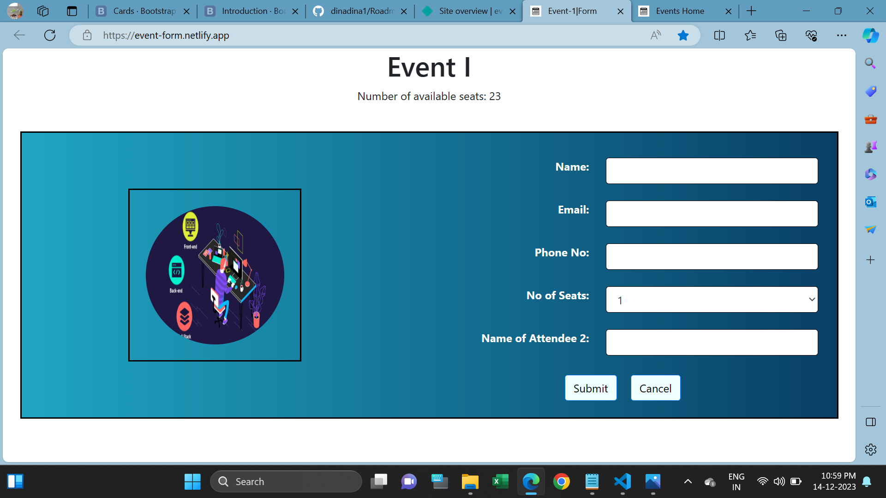

<h1>Event Update Form</h1>

This webpage is used to users booking seats an Event. 

Users must give these details for reserving a seats in the event.

I used Html, CSS and Bootstrap for creating the webpage.

I attached Webpage screenshot in below and find it.

<h2>Website URL</h2>
https://event-form.netlify.app/
  
<h2>Screenshots</h2>

